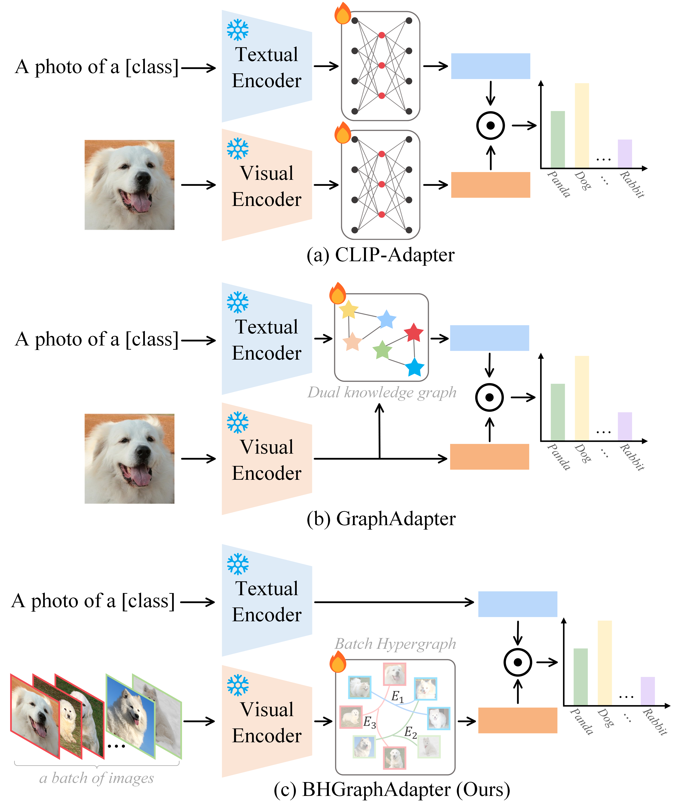

# 《BHGraphAdapter: Parameter-Efficient VLMs Tuning Meets Hyper-Graph Learning》 TCSVT 2026

[paper](https://ieeexplore.ieee.org/abstract/document/11390674/)

## Abstract
Adapter-based fine-tuning methods for Visual-Language Models (VLMs) have shown promising performance for feature adaptation in limited data scenarios. However, existing adapters generally either employ parameterized transformation for multi-modality feature refining or exploit pairwise relationships between classes (i.e., GraphAdapter) for text enhancement, which ignore the inherent high-order correlations among data samples in the adaptation process. In this paper, for the first time, we propose to exploit the high-order relationships of visual samples within each mini-batch for fine-tuning VLMs and develop a novel Batch HyperGraph Adapter (BHGraphAdapter) to fine-tune VLMs. The core idea of BHGraphAdapter is to conduct feature adapter learning by capturing the inherent high-order semantic information of different samples within each mini-batch, which thus can fully exploit the complex context information in adaptation. Specifically, we first construct a Batch HyperGraph (BHGraph) to model the high-order correlation of samples within each mini-batch. Then, we introduce a message propagation module on BHGraph to update the node embeddings by aggregating information from their high-order neighbors, thereby capturing semantic relationships to enrich feature representation. Finally, we incorporate the proposed BHGraph learning into the pre-trained CLIP framework to achieve the feature adaptation for the downstream tasks. Extensive experiments on 11 benchmark datasets show that our proposed BHGraphAdapter outperforms the SOTA adapter tuning methods.

## Overview of existing works and our proposed BHGraphAdapter

## Framwork of BHGraphAdapter

### Acknowledgement
This repo benefits from [Tip-Adapter](https://github.com/gaopengcuhk/Tip-Adapter), [CaFo](https://github.com/OpenGVLab/CaFo) and [CLIP](https://github.com/openai/CLIP). Thanks for their wonderful works.
